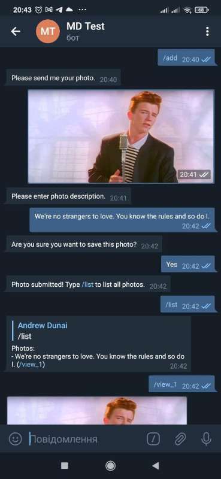

[](https://pkg.go.dev/github.com/and3rson/telemux)

# telemux
Flexible message router add-on for [go-telegram-bot-api](https://github.com/go-telegram-bot-api/telegram-bot-api) library



# Motivation

This library serves as an addition to the [go-telegram-bot-api](https://github.com/go-telegram-bot-api/telegram-bot-api) library.
I strongly recommend you to take a look at it since telemux is mostly an extension to it.

Patterns such as handlers, persistence & filters were inspired by a wonderful [python-telegram-bot](https://github.com/python-telegram-bot/python-telegram-bot) library.

# Features

- Extension for [go-telegram-bot-api](https://github.com/go-telegram-bot-api/telegram-bot-api) library, meaning you'll still use all of its features
- Designed with statelessness in mind
- Extensible handler configuration inspired by [python-telegram-bot](https://github.com/python-telegram-bot/python-telegram-bot) library
- Conversations (aka Dialogs) based on finite-state machines (see [./examples/album_conversation.go](./examples/album_conversation.go))
- Pluggable persistence for conversations. E. g. you can use database to store the intermediate values of some conversation (see [./examples/album_conversation.go](./examples/album_conversation.go) and [./persistence.go](./persistence.go))
- Flexible handler filtering. E. g. `And(Or(IsText(), IsPhoto()), IsPrivate())` will only accept direct messages containing photo or text (see [./filters.go](./filters.go))

# Minimal example

```go
package main

import (
    tm "github.com/and3rson/telemux"
    tgbotapi "github.com/go-telegram-bot-api/telegram-bot-api"
    "log"
    "os"
)

func main() {
    // This part is a boilerplate from go-telegram-bot-api library.
    bot, _ := tgbotapi.NewBotAPI(os.Getenv("TG_TOKEN"))
    bot.Debug = true
    u := tgbotapi.NewUpdate(0)
    u.Timeout = 60
    updates, _ := bot.GetUpdatesChan(u)

    // Create a multiplexer with two handlers: one for command and one for all messages.
    // If a handler cannot handle the update (fails the filter), multiplexer will proceed to the next handler.
    mux := tm.NewMux().
        AddHandler(tm.NewHandler(
            tm.IsCommand("start"),
            func(u *tm.Update) {
                bot.Send(tgbotapi.NewMessage(u.Message.Chat.ID, "Hello! I'm a simple bot who repeats everything you say. :)"))
            },
        )).
        AddHandler(tm.NewHandler(
            tm.Any(),
            func(u *tm.Update) {
                bot.Send(tgbotapi.NewMessage(u.Message.Chat.ID, "You said: "+u.Message.Text))
            },
        ))
    // Dispatch all telegram updates to multiplexer
    for update := range updates {
        mux.Dispatch(&update)
    }
}
```

# Documentation

The documentation is available [here](https://pkg.go.dev/github.com/and3rson/telemux).

Examples are available [here](./examples/).

# Terminology

## Mux
Mux (multiplexer) is a "router" for instances of `tgbotapi.Update`.

It allows you to register handlers and will take care to choose an appropriate handler based on the incoming update.

In order to work, you must dispatch messages (that come from go-telegram-bot-api channel):

```go
mux := tm.NewMux()
// ...
// add handlers to mux here
// ...
updates, _ := bot.GetUpdatesChan(u)
for update := range updates {
    mux.Dispatch(&update)
}
```

## Handlers & filters

Handler consists of filter and handle-function.

Handler's filter decides whether this handler can handle the incoming update.
If so, handle-function is called. Otherwise multiplexer will proceed to the next handler.

There are some built-in filters such as `IsPhoto`, `IsPrivate` etc.
They can also be chained using `And`, `Or` and `Not`. For example:

```go
mux := tm.NewMux()

// Add handler that accepts photos sent to the bot in a private chat:
mux.AddHandler(And(tm.IsPrivate(), tm.IsPhoto()), func(u *tm.Update) { /* ... */ })

// Add handler that accepts bot photos and test messages:
mux.AddHandler(Or(tm.IsText(), tm.IsPhoto()), func(u *tm.Update) { /* ... */ })

// Since filters are plain functions, you can easily implement them yourself.
// Below we add handler that allows onle a specific user to call "/restart" command:
mux.AddHandler(tm.NewHandler(
    tm.And(tm.IsCommand("restart"), func(u *tm.Update) bool {
        return u.Message.From.ID == 3442691337
    }),
    func(u *tm.Update) { /* ... */ },
))
```

## Conversations & persistence

Conversations are handlers on steroids based on the finite-state machine pattern.

They allow you to have complex dialog interactions with different handlers.

Persistence interface tells conversation where to store & how to retrieve the current state of the conversation, i. e. which "step" the given user is currently at.

To create a ConversationHandler you need to provide the following:

- `conversationID string` - identifier that distinguishes this conversation from the others.

    The main goal of this identifier is to allow persistence to keep track of different conversation states independently without mixing them together.

- `persistence Persistence` - defines where to store conversation state & intermediate inputs from the user.

    Without persistence, a conversation would not be able to "remember" what "step" the user is at.

    Persistence is also useful when you want to collect some data from the user step-by-step).

- `states map[string][]*TransitionHandler` - defines which TransitionHandlers to use in what state.

    States are usually strings like "upload_photo", "send_confirmation", "wait_for_text" and describe the "step" the user is currently at.
    It's recommended to have an empty string (`""`) as an initial state (i. e. if the conversation has not started yet or has already finished.)

    For each state you can provide a list of at least one TransitionHandler. If none of the handlers can handle the update, the default handlers are attempted (see below).

    In order to switch to a different state your TransitionHandler must return a string that contains the name of the state you want to switch into.

- `defaults []*TransitionHandler` - these handlers are "appended" to every state.

    Useful to handle commands such as "/cancel" or to display some default message.

See [./examples/album_conversation.go](./examples/album_conversation.go) for a conversation example.
